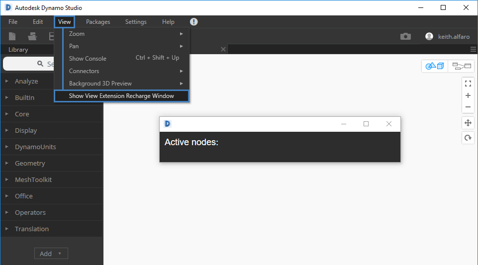
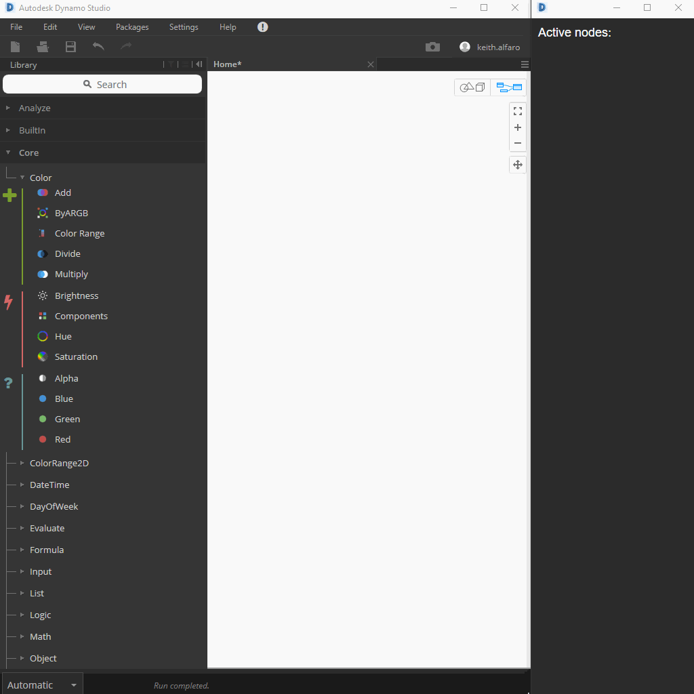

# Recharge 2017

# Building Your First Dynamo View Extension

## Background/Existing Resources

### What is the View Extension framework?
The View Extension framework for Dynamo allows you to extend the Dynamo UI by registering custom MenuItems. A ViewExtension has two components, an assembly containing a class that implements `IViewExtension`, and an `ViewExtensionDefintion` XML file used to instruct Dynamo where to find the class containing the `IViewExtension` implementation.

It used to be required to locate the `ViewExtensionDefinition` XML file inside the `viewExtensions` folder of your Dynamo installation (for instance, `Dynamo\Dynamo Core\2\viewExtensions` for Dynamo 2.0, inside Program Files). Since Dynamo 2.0, View Extensions can be distributed in the package manager as any other package. The folder structure is also similar to that of a package, and you just have to point to your DLL file inside the `bin/` directory of your extension from the XML file.

### Dynamo Samples
DynamoSamples contains a viewExtension sample that demonstrates an `IViewExtension` implementation which shows a modeless window when its `MenuItem` is clicked. The Window created tracks the number of nodes in the current workspace, by handling the workspace's `NodeAdded` and `NodeRemoved` events.

### Other Examples

- [DynamoSamples](https://github.com/DynamoDS/DynamoSamples/tree/master/src/SampleViewExtension)
- [Dynamo Package Manager](https://github.com/DynamoDS/Dynamo/tree/dec6240ded0c4369617775336b9af60c2aba4103/src/DynamoPackagesUI)
- [Dynamo Notifications](https://github.com/DynamoDS/Dynamo/tree/master/src/Notifications) 
- [Librarie.js](https://github.com/DynamoDS/Dynamo/tree/master/src/LibraryViewExtension)
- [DynamoShape](https://github.com/LongNguyenP/DynaShape)

## Creating a ViewExtension Template Project

This first example walks through each step required to create a viewExtension similar to the one in DynamoSamples just to get more familiar with the various requirements.  The end goal is to have a simple pop-up window activated from the Dynamo menu toolbar that displays some information about the active graph.

1) Create a new Visual Studio Class Library project </br>

    This project will be called `RechargeViewExtension`

2) Include the following assemblies
    - `System`
    - `System.Windows`
    - `System.Windows.Controls`
    - `Dynamo.Wpf.Extension` (NuGet DynamoVisualProgramming.WpfUILibrary)

3) Create a new class named RechargeViewExtension and, inside the `RechargeViewExtension.cs` file, extend the IViewExtension class </br>
    ```public class RechargeViewExtension : IViewExtension```

4) `IViewExtension` required implementations that must be included
    - `IViewExtension.Startup()`
    - `IViewExtension.Loaded()`
    - `IViewExtension.Shutdown()`
    - `IViewExtension.UniqueId`
    - `IViewExtension.Name`
    - `IDisposable.Dispose()`

    At this point your class should look something like this...

    ```C#
    namespace RechargeViewExtension
    {
        public class RechargeViewExtension : IViewExtension
        {
            public void Dispose() { }

            public void Startup(ViewStartupParams p) { }

            public void Loaded(ViewLoadedParams p) { }

            public void Shutdown() { }

            public string UniqueId
            {
                get
                {
                    return Guid.NewGuid().ToString();
                }
            }

            public string Name
            {
                get
                {
                    return "Recharge View Extension";
                }
            }
        }
    }
    ```

    This file contains all the information about how our extension will be deployed, loaded, referenced, and disposed.  Pretty self-explanatory for the most part, but we will get into the specifics in the next section when our generic template is complete.

5) Define a `ViewExtensionDefinition.xml` </br>
Let's add an `xml` file that defines our viewExtension to the project.  This should include a reference to our assembly and the type name we defined in our class. So something like this... </br>

    `RechargeViewExtension_ViewExtensionDefinition.xml`
    ```xml
    <ViewExtensionDefinition>
        <AssemblyPath>..\RechargeViewExtension.dll</AssemblyPath>
        <TypeName>RechargeViewExtension.RechargeViewExtension</TypeName>
    </ViewExtensionDefinition>
    ```
    (Note: `xml` file naming must end in `_ViewExtensionDefinition.xml`)

6) Design a pop-up window

    The next step is to define what type of user interface we want to create. For this first example we are going to keep it very simple and implement a new pop-up window that can be launched from the Dynamo menu.  There are 3 steps to this section but we will start by defining the appearance of the window in an `xaml` file.  If you are new to `xaml` it is an XML-based markup language developed by Microsoft.  There is a ton of documentation online and it is very common when working with Wpf.

    There are multiple ways to develop a design using `xaml`.  You can textually define the aesthetic/behavior, use an `xaml` designer for a more physical approach, or a combination of both. </br>

    `RechargeWindow.xaml`

    ```xaml
    <Window x:Class="RechargeViewExtension.RechargeWindow"
                xmlns="http://schemas.microsoft.com/winfx/2006/xaml/presentation"
                xmlns:x="http://schemas.microsoft.com/winfx/2006/xaml"
                xmlns:mc="http://schemas.openxmlformats.org/markup-compatibility/2006" 
                xmlns:d="http://schemas.microsoft.com/expression/blend/2008" 
                xmlns:local="clr-namespace:RechargeViewExtension"
                mc:Ignorable="d" 
                d:DesignHeight="300" d:DesignWidth="300"
                Width="500" Height="100">
        <Grid Name="MainGrid" 
                HorizontalAlignment="Stretch"
                VerticalAlignment="Stretch">
            <TextBlock HorizontalAlignment="Stretch" Text="{Binding SelectedNodesText}" FontFamily="Arial" Padding="10" FontWeight="Medium" FontSize="18" Background="#2d2d2d" Foreground="White" />
        </Grid>
    </Window>
    ```

    (Note: to add an `xaml` file in VS simply create a new text file specifying the extension)
    
    In this file you will notice some very basic properties defined regarding the aesthetic of our window.  Make sure to rename any references appropriately. It should like similar to this... </br>

    

    We also need to create a `C#` backing file for initializing our window. This can be accomplished by adding an additional text file named `RechargeWindow.xaml.cs`. Using this naming convention should automatically nest the `C#` file under our `xaml` file. Add the following code to this new file...

    ```C#
    using System.Windows;

    namespace RechargeViewExtension
    {
        /// <summary>
        /// Interaction logic for RechargeWindow.xaml
        /// </summary>
        public partial class RechargeWindow : Window
        {
            public RechargeWindow()
            {
                InitializeComponent();
            }
        }
    }
    ```

7) Define the window behavior

    Now we will define how our window responds to various events in a new `C#` class file. This class will inherit from `NotificationObject` which will provide notifications from changes in Dynamo and `IDisposable`. You should also included the following assemblies: </br>
    - System
    - Dynamo.Core (these 3 should already be referenced in the project when we added the NuGet Pkg)
    - Dynamo.Extensions
    - Dynamo.Graph.Nodes

    `RechargeWindowViewModel.cs`

    ```C#
    namespace RechargeViewExtension
    {
        public class RechargeWindowViewModel : NotificationObject, IDisposable
        {
            private ReadyParams readyParams;

            public RechargeWindowViewModel(ReadyParams p)
            {
                readyParams = p;
            }

            private void CurrentWorkspaceModel_NodesChanged(NodeModel obj)
            {
                RaisePropertyChanged();
            }

            public void Dispose()
            {
                
            }
        }
    }
    ```

    In this file we are going to respond to various events in Dynamo and instruct the UI to update based on these events.  Again, this is just a template and we will begin roughing out the details in the next section.

## Reacting to Dynamo Events

In this section we are going to revist 2 of the main files we previously setup which were: </br>
- `RechargeViewExtension.cs`
- `RechargeWindowViewModel.cs`

1) Defining viewExtension loading behavior

    Jumping back into our main `RechargeViewExtension.cs` file to define what happens when the extension is loaded into Dynamo. I am going to be overly aggressive with comments to support various C# skill levels so bear with me :)

    ```C#
    public class RechargeViewExtension : IViewExtension
    {
        // Create a variable for our menu item, this is how the
        // user will launch the pop-up window within Dynamo
        private MenuItem rechargeMenuItem;

        public void Dispose() { }

        public void Startup(ViewStartupParams p) { }

        public void Loaded(ViewLoadedParams p)
        {
            // Specify the text displayed on the menu item
            rechargeMenuItem = new MenuItem {Header = "Show View Extension Recharge Window"};
            
            // Define the behavior when menu item is clicked
            rechargeMenuItem.Click += (sender, args) =>
            {
                // Instantiate a viewModel and a window
                var viewModel = new RechargeWindowViewModel(p);
                var window = new RechargeWindow
                {
                    // Set the data context for the main grid in the window.
                    // This refers to the main grid also seen in our xaml file
                    MainGrid = { DataContext = viewModel },

                    // Set the owner of the window to the Dynamo window.
                    Owner = p.DynamoWindow
                };

                // Set the window position
                window.Left = window.Owner.Left + 400;
                window.Top = window.Owner.Top + 200;

                // Show a modeless window.
                window.Show();
            };

            // add the menu item to our loaded parameters
            p.AddMenuItem(MenuBarType.View, rechargeMenuItem);
        }

        public void Shutdown() { }

        public string UniqueId
        {
            get
            {
                return Guid.NewGuid().ToString();
            }  
        } 

        public string Name
        {
            get
            {
                return "Recharge View Extension";
            }
        } 
    }
    ```

2) Update Window UI

    Here we will add the logic to respond to various events in Dynamo and instruct the UI to update based on these events. Begin by opening the `RechargeWindowViewModel.cs` file and making the following additions explained below...

    ```C#
    class RechargeWindowViewModel : NotificationObject, IDisposable
    {
        private string selectedNodesText = "Begin selecting ";

        // Variable for storing a reference to our loaded parameters
        private ReadyParams readyParams;

        // Display the nickname of nodes in the active workspace
        public string SelectedNodesText => $"Active nodes:\n{getNodeNicknames()}";

        // Helper method that returns a string containing all the active nodes nicknames
        public string getNodeNicknames()
        {
            string output = "";

            foreach (NodeModel node in readyParams.CurrentWorkspaceModel.Nodes)
            {
                string nickName = node.NickName;
                output += nickName + "\n";
            }

            return output;
        }

        public RechargeWindowViewModel(ReadyParams p)
        {
            // Save a reference to our loaded parameters which
            // is required in order to access the workspaces
            readyParams = p;

            // Subscribe to NodeAdded and NodeRemoved events
            p.CurrentWorkspaceModel.NodeAdded += CurrentWorkspaceModel_NodesChanged;
            p.CurrentWorkspaceModel.NodeRemoved += CurrentWorkspaceModel_NodesChanged;
        }

        // Define what happens when the event above if triggered
        private void CurrentWorkspaceModel_NodesChanged(NodeModel obj)
        {
            // Event used to notify UI or bound elements that
            // the data has changed and needs to be updated
            RaisePropertyChanged("SelectedNodesText");
        }

        // Very important - unsubscribe from our events to prevent a memory leak
        public void Dispose()
        {
            readyParams.CurrentWorkspaceModel.NodeAdded -= CurrentWorkspaceModel_NodesChanged;
            readyParams.CurrentWorkspaceModel.NodeRemoved -= CurrentWorkspaceModel_NodesChanged;
        }
    }
    ```

    Our window should now be accessible in the `View` tab in Dynamo.  Once launched we will have some initial text and will populate/remove any nodes placed in the workspace triggered by the `NodeAdded` and `NodeRemoved` events.

3) Build </br>

    This part is easy...
    - Select `Debug` or `Release` depending on your goal
    - Navigate to `Build >> Build Solution`

    Your local repo should now contain a bin folder containing a series of .dlls </br>
    `..\DynamoExtensions_Recharge2017\src\RechargeViewExtension\RechargeViewExtension\bin`

4) Load viewExtension in Dynamo

    Loading a custom viewExtension is a bit more complicating than loading a package. For now we will manually place the required files in their respective locations. This process can be tedious when developing and can be automated using a post build step in Visual Studio.  We will take a look at that later. For now here is what has to happen...

    - Copy `RechargeViewExtension_ViewExtensionDefinition.xml` located in </br>`\..\DynamoExtensions_Recharge2017\src\RechargeViewExtension\RechargeViewExtension` to </br>
    `C:\Program Files\Dynamo\Dynamo Core\1.3\viewExtensions` or </br>
    `C:\Program Files\Dynamo\Dynamo Revit\1.3\viewExtensions` </br>
    (The first location is for Dynamo Studio and the second if for Dynamo for Revit)

    - Copy `RechargeViewExtension.dll` located in <br/>
    `\..\DynamoExtensions_Recharge2017\src\RechargeViewExtension\RechargeViewExtension\bin\Release` to </br>
    `C:\Program Files\Dynamo\Dynamo Core\1.3` </br> or
    `C:\Program Files\Dynamo\Dynamo Revit\1.3\Revit_2017` </br>
    (Again The first location is for Dynamo Studio and the second if for Dynamo for Revit)

    Depending on which version of Dynamo you are using you need to adjust the file directories accordingly. It is also very important that you are using the appropriate NuGet packages that correspond to the build you plan on deploying on.  For example, don't use the 1.2 NuGet if you are running 1.3.  And remember 2.0 is coming and there are API changes :)
    
    To be redundant, your files should now be located similarly to this... </br>
    `C:\Program Files\Dynamo\Dynamo Core\1.3\viewExtensions\RechargeViewExtension_ViewExtensionDefinition`</br>
    `C:\Program Files\Dynamo\Dynamo Core\1.3\RechargeViewExtension.dll`

    Now it is finally time to launch Dynamo! Navigate to the `View` tab in the main menu and at the bottom you should see a new option to show our view extension.  Selecting this option should launch our `RechargeWindow`.  If you don't see this or are running into additional issue check out the debugging section below. </br>

    

    As you add and remove nodes to the workspace our new window should dynamically update with the node nicknames.

    


