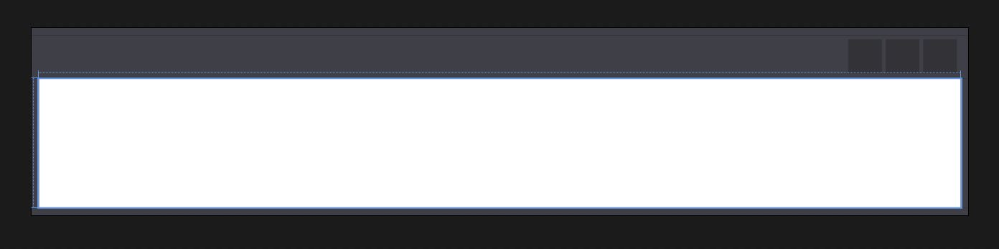

# Recharge 2017

# Day 1

## Background/Existing Resources

### What is the View Extension framework?
The View Extension framework for Dynamo allows you to extend the Dynamo UI by registering custom MenuItems. A ViewExtension has two components, an assembly containing a class that implements `IViewExtension`, and an `ViewExtensionDefintion` xml file used to instruct Dynamo where to find the class containing the `IViewExtension` implementation. The `ViewExtensionDefinition` xml file must be located in your `dynamo\viewExtensions` folder.

### Dynamo Samples
DynamoSampples contains a viewExtentsion sample that demonstrates an `IViewExtension` implementation which shows a modeless window when its `MenuItem` is clicked. The Window created tracks the number of nodes in the current workspace, by handling the workspace's `NodeAdded` and `NodeRemoved` events.

### Other Examples

- [DynamoSamples](https://github.com/DynamoDS/DynamoSamples/tree/master/src/SampleViewExtension)
- [Dynamo Package Manager](https://github.com/DynamoDS/Dynamo/tree/dec6240ded0c4369617775336b9af60c2aba4103/src/DynamoPackagesUI)
- [Dynamo Notifications](https://github.com/DynamoDS/Dynamo/tree/master/src/Notifications) 
- [Librarie.js](https://github.com/DynamoDS/Dynamo/tree/master/src/LibraryViewExtension)
- [DynamoShape](https://github.com/LongNguyenP/DynaShape)

## Creating a ViewExtension Template Project

This first example walks through each step required to create a viewExtenion similar to the one in DynamoSamples just to get more familiar with the various requirements.  The end goal is to have a simple pop-up window activated from the Dynamo menu toolbar that displays some information about the active graph.

1) Create a new Visual Studio Class Library project
    - This project will be called RechargeViewExtension

2) Include the following assemblies
    - `System`
    - `System.Windows`
    - `System.Windows.Controls`
    - `Dynamo.Wpf.Extension` (NuGet DynamoVisualProgramming.WpfUILibrary)

3) Extend the IViewExtension class </br>
    ```public class RechargeViewExtension : IViewExtension```

4) `IViewExtension` required implementations that must be included
    - `IViewExtension.Startup()`
    - `IViewExtension.Loaded()`
    - `IViewExtension.Shutdown()`
    - `IViewExtension.UniqueId`
    - `IViewExtension.Name`
    - `IDisposable.Dispose()`

    At this point your class should look something like this...

    ```C#
    namespace RechargeViewExtension
    {
        public class RechargeViewExtension : IViewExtension
        {
            public void Dispose() { }

            public void Startup(ViewStartupParams p) { }

            public void Loaded(ViewLoadedParams p) { }

            public void Shutdown() { }

            public string UniqueId
            {
                get
                {
                    return Guid.NewGuid().ToString();
                }
            }

            public string Name
            {
                get
                {
                    return "Recharge View Extension";
                }
            }
        }
    }
    ```

    This file contains all the information about how our extension will be deployed, loaded, referenced, and disposed.  Pretty self-explanatory for the most part, but we will get into the specifics in the next section when our generic template is complete.

5) Define a `ViewExtensionDefinition.xml` </br>
Let's add an `xml` file that defines our viewExtension to the project.  This should include a reference to our assembly and the type name we defined in our class. So something like this... </br>

    `RechargeViewExtension_ViewExtensionDefinition.xml`
    ```xml
    <ViewExtensionDefinition>
        <AssemblyPath>..\RechargeViewExtension.dll</AssemblyPath>
        <TypeName>RechargeViewExtension.RechargeViewExtension</TypeName>
    </ViewExtensionDefinition>
    ```

6) Design a pop-up window

    The next step is to define what type of user interface we want to create. For this first example we are going to keep it very simple and implement a new pop-up window that can be launched from the Dynamo menu.  There are 3 steps to this section but we will start by defining the appearance of the window in an `xaml` file.  If you are new to `xaml` it is an XML-based markup language developed by Microsoft.  There is a ton of documentation online and it is very common when working with Wpf.

    There are multiple ways to develop a design using `xaml`.  You can textually define the aesthetic/behavior, use an `xaml` designer for a more physical approach, or a combination of both. </br>

    `RechargeWindow.xaml`

    ```xaml
    <Window x:Class="RechargeViewExtension.RechargeWindow"
             xmlns="http://schemas.microsoft.com/winfx/2006/xaml/presentation"
             xmlns:x="http://schemas.microsoft.com/winfx/2006/xaml"
             xmlns:mc="http://schemas.openxmlformats.org/markup-compatibility/2006" 
             xmlns:d="http://schemas.microsoft.com/expression/blend/2008" 
             xmlns:local="clr-namespace:RechargeViewExtension"
             mc:Ignorable="d" 
             d:DesignHeight="300" d:DesignWidth="300"
            Width="500" Height="100">
        <Grid Name="MainGrid" 
            HorizontalAlignment="Stretch"
            VerticalAlignment="Stretch">
                <TextBlock HorizontalAlignment="Stretch" Text="{Binding SelectedNodesText}" FontWeight="Bold" FontSize="24"/>
        </Grid>
    </Window>
    ```

    (Note: to add an `xaml` file in VS simply create a new text file specifying the extension)
    
    In this file you will notice some very basic properties defined regarding the aesthetic of our window.  Make sure to rename any references appropriately. It should like similar to this... </br>

    

7) Define the window behavior

    Now we will define how our window responds to various events in a new C# class file. This class will inherit from `NotificationObject` which will provide notifications from changes in Dynamo and `IDisposable`. You should also included the following assemblies: </br>
    - System
    - Dynamo.Core (these 3 should already be referenced in the project when we added the NuGet Pkg)
    - Dynamo.Extensions
    - Dynamo.Graph.Nodes

    `RechargeWindowViewModel.cs`

    ```C#
    namespace RechargeViewExtension
    {
        public class RechargeWindowViewModel : NotificationObject, IDisposable
        {
            private ReadyParams readyParams;

            public RechargeWindowViewModel(ReadyParams p)
            {
                readyParams = p;
            }

            private void CurrentWorkspaceModel_NodesChanged(NodeModel obj)
            {
                RaisePropertyChanged();
            }

            public void Dispose()
            {
                
            }
        }
    }
    ```

    In this file we are going to respond to various events in Dynamo and instruct the UI to update based on these events.  Again, this is just a template and we will begin roughing out the details in the next section.


